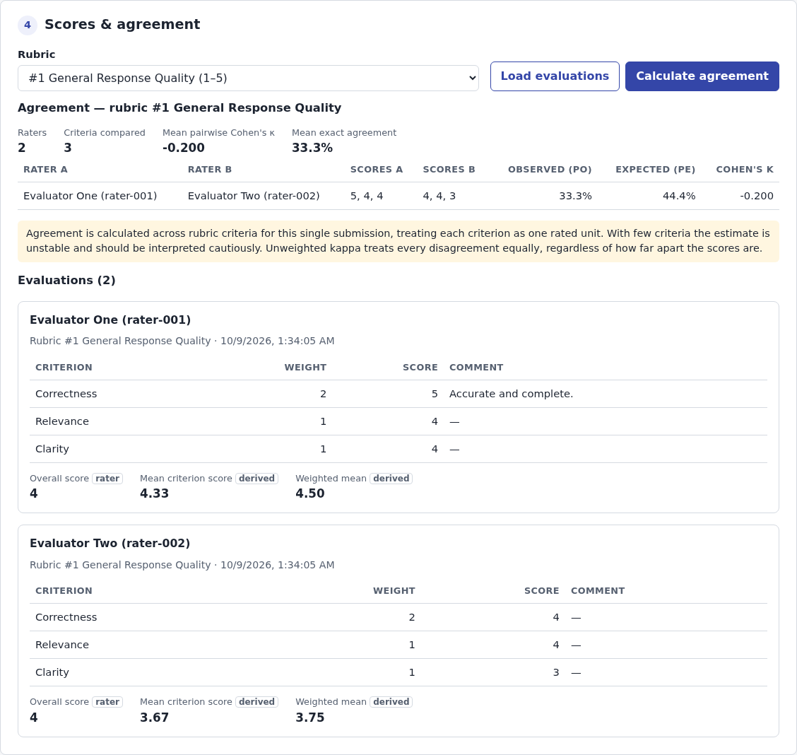
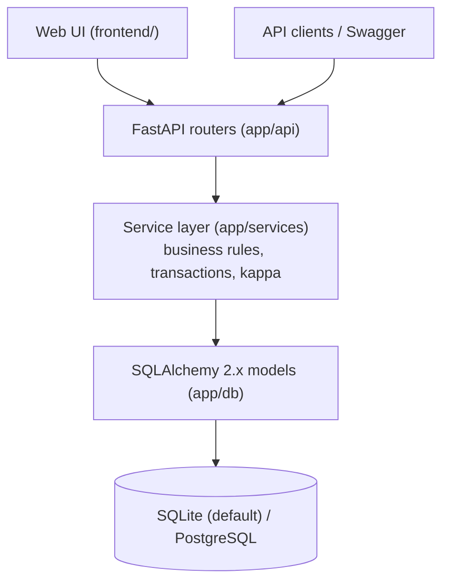
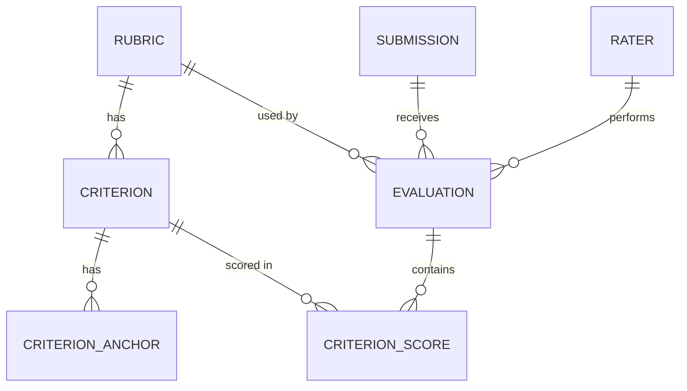

# AI Model Evaluation & Rubric Management API

## Overview

This service supports structured human evaluation of AI/LLM outputs. Evaluation designers define
**rubrics**: a shared integer scoring scale plus weighted criteria, each with a descriptive anchor
for every score. Model outputs are stored as **submissions** together with the prompt, model
identity, arbitrary run metadata and an optional reference answer.

Human **raters** score a submission against a rubric. Each evaluation must score every criterion of
the rubric exactly once, within the rubric's scale, plus a holistic overall score. Scoring is
transactional, and the same rater cannot evaluate the same submission with the same rubric twice.

When two or more raters have scored a submission with the same rubric, the API reports
**inter-rater agreement** as pairwise Cohen's kappa. The result includes the observed and expected
agreement behind each kappa, not just the final number.

The project has three parts: a REST API, a small web interface written in plain HTML, CSS and
JavaScript, and interactive Swagger documentation. FastAPI serves all three from one process, so
a reviewer can run the whole workflow in a browser without Node.js or a second server.



## Features

- Rubric creation with a common integer scale, weighted criteria and complete score anchors
- Submissions with a free-form JSON `model_metadata` field and an optional reference answer
- Multi-rater evaluation with stable rater identities (`external_id`), without authentication
- Strict validation: complete, in-range, rubric-consistent scoring, with structured error codes
- Duplicate-evaluation prevention (409), enforced in the service and by a database unique constraint
- Atomic scoring: an evaluation and all its criterion scores are committed together or not at all
- Derived statistics (mean and weighted mean criterion score) kept separate from the human score
- Pairwise Cohen's kappa agreement analysis with explicit handling of undefined cases
- Web interface at `/`: plain HTML, CSS and JavaScript with no build step, served by FastAPI
- OpenAPI / Swagger documentation, a `/health` check and structured JSON request logs
- Automated tests (pytest) and a CI workflow that runs lint, format and test checks

## Architecture



```text
app/
  main.py          application factory, router registration, schema creation on startup
  api/             thin HTTP routers: parse input, call a service, return a schema
  services/        business rules: rubric, submission, evaluation and agreement services
  schemas/         Pydantic v2 request/response models (structural validation)
  db/              SQLAlchemy models, UTC datetime type, engine and session dependency
  core/            settings, error types and handler, JSON request logging
tests/             pytest suite; every test uses its own temporary SQLite database
frontend/          index.html, styles.css, app.js: the web interface (served at / and /static)
scripts/           demo_flow.py: runs the full workflow against a live server
```

Validation happens in two layers. Pydantic checks request shape and rules that need only the
payload, such as rubric anchors. Services check rules that need the database, such as whether a
criterion belongs to the rubric. Database constraints are the final safeguard.

## Data model



| Entity | Purpose | Key constraints |
| --- | --- | --- |
| **Rubric** | Name, description and shared integer scale (`scale_min`–`scale_max`). | `scale_min < scale_max` |
| **Criterion** | A dimension of the rubric with description, `weight` (default 1.0) and `position`. | unique `(rubric_id, name)`; `weight > 0` |
| **CriterionAnchor** | Label and description for one score of one criterion. | unique `(criterion_id, score)` |
| **Submission** | Prompt, output, `model_name`, optional `model_version`, JSON `model_metadata`, optional `reference_answer`. | — |
| **Rater** | An evaluator, identified by a stable `external_id`. | unique `external_id` |
| **Evaluation** | One rater's assessment of one submission with one rubric: `overall_score` and `comments`. | unique `(submission_id, rubric_id, rater_id)` |
| **CriterionScore** | The score and optional comment for one criterion within an evaluation. | unique `(evaluation_id, criterion_id)` |

Cascades are deliberate:

- Deleting a rubric removes its criteria and anchors.
- Deleting a submission removes its evaluations and their criterion scores.
- Rubrics, criteria and raters referenced by evaluations are `RESTRICT`ed, so a criterion score can
  never be orphaned. SQLite foreign keys are enabled on every connection.

All timestamps are timezone-aware UTC and are returned as ISO 8601. `model_metadata` uses `JSON` on
SQLite and `JSONB` on PostgreSQL.

## Running locally

See [instructions.md](instructions.md) for complete setup instructions, including Windows,
PostgreSQL and troubleshooting. Quick start (Python 3.12+):

```bash
python -m venv .venv
source .venv/bin/activate            # Windows (PowerShell): .venv\Scripts\Activate.ps1
pip install -e ".[dev]"
uvicorn app.main:app --reload
```

| URL | What |
| --- | --- |
| <http://127.0.0.1:8000/> | Web interface |
| <http://127.0.0.1:8000/docs> | Swagger / OpenAPI documentation |
| <http://127.0.0.1:8000/health> | Health check |

The schema is created on startup. Data is stored in `./eval.db` (SQLite) unless `DATABASE_URL`
is set; PostgreSQL works through the same setting.

### Demo workflow

**In the browser:** open `/` and work through the four numbered sections. Each form has a
**Fill example** button:

1. Create a rubric.
2. Create a submission.
3. Score the submission as one rater, then as a second rater. The rater ID advances
   automatically.
4. Load the evaluations and calculate agreement.

**From the command line:** with the server running, run `python scripts/demo_flow.py`. It goes
through the same flow through the API and prints each response.

## Test with VS Code REST Client

[`api.http`](api.http) includes a complete demo dataset and can reproduce the same workflow shown
in the frontend: rubric creation, model submission, two human evaluations, score retrieval,
agreement analysis, and validation failures.

1. Install the VS Code extension **REST Client** (`humao.rest-client`).
2. Start the app: `uvicorn app.main:app --reload`.
3. Open `api.http`.
4. Click **Send Request** above each request, top to bottom.

Later requests take their IDs from earlier responses, so nothing needs to be copied by hand.

## API examples

Business-rule errors share one format:

```json
{"detail": {"code": "INVALID_CRITERION_SCORE", "message": "Score 6 is outside rubric scale 1-5.", "field": "criterion_scores[1].score"}}
```

Payload shape errors (missing fields, wrong types, invalid rubric anchors) use FastAPI's standard
422 response, with the location of each error.

### Health

```bash
curl http://127.0.0.1:8000/health
# {"status":"ok","database":"ok"}
```

### `POST /rubrics` → 201

```bash
curl -X POST http://127.0.0.1:8000/rubrics -H "Content-Type: application/json" -d '{
  "name": "General Response Quality",
  "description": "Evaluates correctness, relevance and clarity.",
  "scale_min": 1,
  "scale_max": 5,
  "criteria": [
    {"name": "Correctness", "description": "Is the response factually and logically correct?", "weight": 2.0,
     "anchors": [
       {"score": 1, "label": "Incorrect",  "description": "Major factual or logical errors."},
       {"score": 2, "label": "Weak",       "description": "Substantial errors."},
       {"score": 3, "label": "Acceptable", "description": "Mostly correct with minor issues."},
       {"score": 4, "label": "Strong",     "description": "Correct with very minor shortcomings."},
       {"score": 5, "label": "Excellent",  "description": "Fully correct and well supported."}]},
    {"name": "Relevance", "description": "Does it address the prompt?",
     "anchors": [
       {"score": 1, "label": "Off-topic"}, {"score": 2, "label": "Tangential"},
       {"score": 3, "label": "Partly relevant"}, {"score": 4, "label": "Relevant"},
       {"score": 5, "label": "Fully on point"}]},
    {"name": "Clarity", "description": "Is it clear and well organised?",
     "anchors": [
       {"score": 1, "label": "Confusing"}, {"score": 2, "label": "Hard to follow"},
       {"score": 3, "label": "Understandable"}, {"score": 4, "label": "Clear"},
       {"score": 5, "label": "Exceptionally clear"}]}
  ]
}'
```

The response is the full rubric, including generated IDs for the rubric, its criteria and anchors,
and the `created_at` / `updated_at` timestamps. Rubric validation rules:

- `scale_min < scale_max`, with at most 11 scale points.
- Criterion names must be non-empty and unique within the rubric (case-insensitive).
- Weights must be positive.
- Each criterion needs exactly one anchor for every integer score on the scale: no gaps, no
  duplicates, nothing out of range.

### `GET /rubrics` and `GET /rubrics/{id}`

```bash
curl "http://127.0.0.1:8000/rubrics?limit=20&offset=0"   # {"items": [...], "total": 1, "limit": 20, "offset": 0}
curl http://127.0.0.1:8000/rubrics/1                     # 404 RUBRIC_NOT_FOUND if unknown
```

### `POST /submissions` → 201

```bash
curl -X POST http://127.0.0.1:8000/submissions -H "Content-Type: application/json" -d '{
  "prompt": "Explain why idempotency matters in payment APIs.",
  "output": "Idempotency prevents repeated requests from charging a customer twice...",
  "model_name": "example-model",
  "model_version": "v1",
  "model_metadata": {"temperature": 0.2, "provider": "example", "run_id": "abc123"},
  "reference_answer": "A strong answer discusses duplicate requests, retries and idempotency keys."
}'
```

### `GET /submissions`

```bash
curl "http://127.0.0.1:8000/submissions?limit=20&offset=0"
# {"items": [{"id": 1, "model_name": "example-model", "model_version": "v1",
#             "prompt_preview": "Explain why idempotency…", "evaluation_count": 2, "created_at": "…"}],
#  "total": 1, "limit": 20, "offset": 0}
```

Newest first. Each entry is a compact summary; fetch a submission by ID for its full text and
scores.

### `GET /submissions/{id}`

```bash
curl http://127.0.0.1:8000/submissions/1   # includes "evaluations": [...]; 404 SUBMISSION_NOT_FOUND if unknown
```

### `POST /submissions/{submission_id}/scores` → 201

Criterion IDs come from the rubric response.

```bash
curl -X POST http://127.0.0.1:8000/submissions/1/scores -H "Content-Type: application/json" -d '{
  "rubric_id": 1,
  "rater": {"external_id": "rater-001", "name": "Evaluator One"},
  "criterion_scores": [
    {"criterion_id": 1, "score": 5, "comment": "Accurate and complete."},
    {"criterion_id": 2, "score": 4, "comment": "Relevant but slightly verbose."},
    {"criterion_id": 3, "score": 4}
  ],
  "overall_score": 4,
  "comments": "Strong response overall."
}'
```

Repeat with `"external_id": "rater-002"` and different scores to add a second evaluation. The
response contains the evaluator's `overall_score` and a separate, system-derived block:

```json
"derived": {"mean_criterion_score": 4.3333, "weighted_mean_criterion_score": 4.5}
```

| Status | Code | When |
| --- | --- | --- |
| 404 | `SUBMISSION_NOT_FOUND` / `RUBRIC_NOT_FOUND` | Unknown submission (path) or rubric (`rubric_id`) |
| 422 | `CRITERION_NOT_IN_RUBRIC` | A criterion ID belongs to a different rubric or does not exist |
| 422 | `DUPLICATE_CRITERION_SCORE` | A criterion is scored twice |
| 422 | `MISSING_CRITERION_SCORES` | A rubric criterion is not scored |
| 422 | `INVALID_CRITERION_SCORE` / `INVALID_OVERALL_SCORE` | A score is outside the rubric scale |
| 422 | (FastAPI validation) | Non-integer score, invalid rater identity, unknown fields |
| 409 | `DUPLICATE_EVALUATION` | This rater already evaluated this submission with this rubric |

### `GET /submissions/{submission_id}/scores`

```bash
curl http://127.0.0.1:8000/submissions/1/scores
curl "http://127.0.0.1:8000/submissions/1/scores?rubric_id=1"
```

### `GET /submissions/{submission_id}/agreement`

```bash
curl http://127.0.0.1:8000/submissions/1/agreement
curl "http://127.0.0.1:8000/submissions/1/agreement?rubric_id=1"
```

```json
{
  "submission_id": 1,
  "rubric_id": 1,
  "method": "cohens_kappa_pairwise",
  "rater_count": 2,
  "criterion_count": 3,
  "criterion_ids": [1, 2, 3],
  "pairwise": [
    {
      "rater_a": {"id": 1, "external_id": "rater-001", "name": "Evaluator One"},
      "rater_b": {"id": 2, "external_id": "rater-002", "name": "Evaluator Two"},
      "scores_a": [5, 4, 4],
      "scores_b": [4, 4, 3],
      "compared_criteria": 3,
      "observed_agreement": 0.3333,
      "expected_agreement": 0.4444,
      "kappa": -0.2,
      "kappa_note": null
    }
  ],
  "mean_pairwise_kappa": -0.2,
  "mean_pairwise_exact_agreement": 0.3333,
  "note": "Agreement is calculated across rubric criteria for this single submission ..."
}
```

- **409 `INSUFFICIENT_EVALUATIONS`**: fewer than two evaluations exist for the rubric. The API
  returns an error rather than a misleading 0.
- **422 `RUBRIC_ID_REQUIRED`**: the submission was scored with several rubrics and no `rubric_id`
  was given.

## Running tests

```bash
pytest
```

Each test gets a fresh temporary SQLite database, so the suite never touches `eval.db` and gives
the same results on every run. The suite covers:

- rubric validation (missing, duplicate and out-of-range anchors; duplicate or empty criterion
  names; scale and weight rules)
- submissions and 404s
- every scoring rule, including duplicate evaluations, atomic rollback and a simulated concurrent
  duplicate caught by the database constraint
- the kappa function against known examples, including a degenerate case
- the agreement endpoint with one, two and three raters, and with several rubrics
- the submissions list, and that the web interface and static files are served without shadowing
  the API or `/docs`

Lint and format checks:

```bash
ruff check .
ruff format --check .
```

## Agreement metric

For one submission, the **rated units are the rubric's criteria**. Each rater who scored the
submission with the rubric gives one score vector in criterion order, for example:

```text
rater A: [5, 4, 3, 5]
rater B: [5, 3, 3, 4]
```

For every pair of raters, the API computes unweighted Cohen's kappa:

```text
Po    = share of criteria with identical scores                  = 2/4  = 0.5
Pe    = Σ_k P_A(k) · P_B(k)   (each rater's own score frequencies) = 5/16 = 0.3125
kappa = (Po − Pe) / (1 − Pe)                                       = 3/11 ≈ 0.273
```

With more than two raters, the API returns every pair along with the mean pairwise kappa and the
mean exact agreement. Kappa is implemented in about 15 lines of pure Python
(`app/services/agreement_service.py`) and tested on its own. It uses exact fractions, so the
degenerate case below is detected reliably. No machine-learning dependency is needed for one
metric.

**Degenerate case:** when both raters give every criterion the same single score, `Pe = 1` and the
formula is 0/0. The API then returns `kappa: null` with a `kappa_note` explaining why, while
`observed_agreement` still reports 1.0. Undefined pairs are left out of `mean_pairwise_kappa`,
which is `null` if no pair is defined. Reporting 0 or 1 here would be misleading.

**Limitations:**

- A rubric has few criteria, so per-submission kappa rests on only 3–10 observations. This makes
  it noisy, and it can swing sharply with one disagreement.
- Unweighted kappa treats a 4-vs-5 disagreement the same as 1-vs-5. In the demo, two raters who
  are never more than one point apart get κ = −0.2.
- Criteria are not exchangeable units: they measure different things.

The result is useful as a quick consistency signal, and the response `note` says so. For more
reliable agreement figures, compute kappa per criterion across many submissions (see
future improvements below).

## Design decisions

- **Common rubric scale:** all criteria in a rubric share one integer scale. This keeps scoring
  easy to understand and validation simple, and it is what makes criterion-level kappa coherent.
- **Complete anchors:** every scale point of every criterion has a label, so raters always score
  against a described level.
- **Complete criterion scoring:** an evaluation must score every criterion exactly once. Partial
  evaluations would make derived scores and agreement ambiguous.
- **Human score vs derived score:** `overall_score` is the evaluator's holistic judgement and is
  never recalculated. `derived.mean_criterion_score` and
  `derived.weighted_mean_criterion_score` (`Σ score·weight / Σ weight`) are reported separately.
  Weights do not need to sum to 1.
- **Duplicate prevention:** the service rejects a second evaluation for the same
  submission + rubric + rater with 409, and a unique constraint catches concurrent races. Existing
  evaluations are never overwritten.
- **Transactional scoring:** all rules are checked before any write. The evaluation, its criterion
  scores and any new rater are committed in a single transaction, and any failure rolls back
  everything.
- **Rater identity without auth:** raters are matched by `external_id` and created on first use.
  If a later request sends a different `name`, the stored display name is updated.
- **Status codes:** 201 for creation, 404 for unknown resources (including a `rubric_id` in the
  body), 409 for state conflicts (duplicate evaluation, not enough evaluations for agreement),
  and 422 for invalid input. Both Pydantic shape errors and business-rule violations use 422.
- **SQLite by default, PostgreSQL-compatible:** there is no setup for reviewers. Portable
  SQLAlchemy types are used, with JSON → JSONB on PostgreSQL and a UTC datetime type that also
  works on SQLite.
- **Schema creation on startup** instead of Alembic, to keep the assessment easy to run.
- **Privacy-aware logging:** request logs record only the method, route template, status code and
  duration. Prompts, outputs, reference answers and comments are never logged.
- **Same-origin web interface:** FastAPI serves the UI, so no CORS configuration is needed and none
  is enabled. The UI renders all API data with `textContent` and DOM nodes, never `innerHTML`, so
  prompts and model outputs that contain HTML stay plain text. A Content-Security-Policy restricts
  the page to same-origin scripts.
- **Bounded input:** text fields, the size of `model_metadata`, the number of criteria and the
  number of scale points all have limits. Unknown request fields are rejected.

## Trade-offs and future improvements

None of the following is implemented. Each is a realistic next step:

- Authentication and role-based access control (rubric authors, raters, analysts)
- Rubric versioning, so a rubric can change without invalidating existing evaluations
- An explicit workflow for revising evaluations, with an audit trail
- Blind evaluation: hiding other raters' scores and model identity from raters
- Batch submission and batch scoring endpoints
- Dataset-level agreement: per-criterion kappa across many submissions, weighted (quadratic) kappa
  for ordinal scales, and Fleiss' kappa or Krippendorff's alpha for many raters with missing data
- Alembic migrations for production schema changes
- Rubric editing and archiving. The API supports creation only, so the UI does too.
- Browser end-to-end tests in CI. The UI is currently verified manually, plus pytest checks that it
  is served.
